# Diagrama de Componentes - Mapa Colaborativo de Acessibilidade

## Visão Geral da Arquitetura

O sistema é composto por múltiplas camadas e componentes que trabalham em conjunto para fornecer uma API robusta para mapeamento colaborativo de acessibilidade.

## Diagrama de Componentes

```mermaid
graph TB
    %% Frontend Layer
    subgraph "Frontend Layer"
        FE[Frontend Application<br/>React/Vue/Angular]
    end

    %% API Gateway Layer
    subgraph "API Gateway Layer"
        API[Fastify Server<br/>Port: 3333]
        DOCS[API Documentation<br/>Swagger/Scalar]
    end

    %% Authentication Layer
    subgraph "Authentication Layer"
        AUTH[Auth Middleware<br/>JWT Validation]
        LOGIN[Login Route<br/>POST /auth/login]
        REGISTER[Register Route<br/>POST /auth/register]
        LOGOUT[Logout Route<br/>POST /auth/logout]
    end

    %% Core Business Logic Layer
    subgraph "Core Business Logic Layer"
        subgraph "User Management"
            USER_ME[Get Me Route<br/>GET /users/me]
            USER_UPDATE[Update Me Route<br/>PUT /users/me]
            USER_DELETE[Delete Me Route<br/>DELETE /users/me]
            USER_ALL[Get All Users Route<br/>GET /users]
        end

        subgraph "Places Management"
            PLACE_SEARCH[Search Nearby Route<br/>GET /places/search-nearby]
            PLACE_CREATE[Check or Create Route<br/>POST /places/check-or-create]
            PLACE_GET[Get Place Route<br/>GET /places/:id]
            PLACE_UPDATE[Update Place Route<br/>PUT /places/:id]
            PLACE_ALL[Get All Places Route<br/>GET /places]
            PLACE_REPORTS[Get Place Reports Route<br/>GET /places/:id/reports]
        end

        subgraph "Reports Management"
            REPORT_CREATE[Create Report Route<br/>POST /places/:id/reports]
            REPORT_GET[Get Report Route<br/>GET /reports/:id]
            REPORT_UPDATE[Update Report Route<br/>PUT /reports/:id]
            REPORT_DELETE[Delete Report Route<br/>DELETE /reports/:id]
            REPORT_LIST[List Reports Route<br/>GET /reports]
        end

        subgraph "Voting System"
            VOTE_CREATE[Create Vote Route<br/>POST /reports/:id/votes]
            VOTE_DELETE[Delete Vote Route<br/>DELETE /reports/:id/votes]
        end

        subgraph "Statistics System"
            STATS_REPORTS[Report Statistics<br/>GET /stats/reports]
            STATS_USERS[User Statistics<br/>GET /stats/users]
            STATS_PLACES[Place Statistics<br/>GET /stats/places]
            STATS_VOTES[Vote Statistics<br/>GET /stats/votes]
        end

        subgraph "Admin System"
            ADMIN_REPORTS[Admin Reports Management<br/>GET/PUT/DELETE /admin/reports]
            ADMIN_USERS[Admin Users Management<br/>GET/PUT/DELETE /admin/users]
            ADMIN_PLACES[Admin Places Management<br/>GET/PUT/DELETE /admin/places]
            ADMIN_MODERATION[Content Moderation<br/>POST /admin/moderate]
        end
    end

    %% Services Layer
    subgraph "Services Layer"
        PLACE_SERVICE[Places Service<br/>Google Maps Integration]
        AUTH_SERVICE[Auth Service<br/>JWT & Password Hashing]
        STATS_SERVICE[Statistics Service<br/>Data Aggregation]
        ADMIN_SERVICE[Admin Service<br/>Moderation & Management]
    end

    %% Data Access Layer
    subgraph "Data Access Layer"
        DB_CLIENT[Database Client<br/>Drizzle ORM]
        SCHEMA[Database Schema<br/>Tables & Relations]
    end

    %% External Services
    subgraph "External Services"
        GOOGLE_MAPS[Google Maps API<br/>Places & Geocoding]
        JWT_SERVICE[JWT Service<br/>Token Generation/Validation]
    end

    %% Database Layer
    subgraph "Database Layer"
        POSTGRES[(PostgreSQL Database<br/>Primary Data Store)]
        TABLES[Tables:<br/>• users<br/>• places<br/>• reports<br/>• votes]
    end

    %% Connections
    FE --> API
    API --> DOCS
    API --> AUTH
    API --> LOGIN
    API --> REGISTER
    API --> LOGOUT
    API --> USER_ME
    API --> USER_UPDATE
    API --> USER_DELETE
    API --> USER_ALL
    API --> PLACE_SEARCH
    API --> PLACE_CREATE
    API --> PLACE_GET
    API --> PLACE_UPDATE
    API --> PLACE_ALL
    API --> PLACE_REPORTS
    API --> REPORT_CREATE
    API --> REPORT_GET
    API --> REPORT_UPDATE
    API --> REPORT_DELETE
    API --> REPORT_LIST
    API --> VOTE_CREATE
    API --> VOTE_DELETE
    API --> STATS_REPORTS
    API --> STATS_USERS
    API --> STATS_PLACES
    API --> STATS_VOTES
    API --> ADMIN_REPORTS
    API --> ADMIN_USERS
    API --> ADMIN_PLACES
    API --> ADMIN_MODERATION

    AUTH --> AUTH_SERVICE
    LOGIN --> AUTH_SERVICE
    REGISTER --> AUTH_SERVICE
    LOGOUT --> AUTH_SERVICE

    PLACE_SEARCH --> PLACE_SERVICE
    PLACE_CREATE --> PLACE_SERVICE
    PLACE_GET --> PLACE_SERVICE
    PLACE_UPDATE --> PLACE_SERVICE
    PLACE_ALL --> PLACE_SERVICE
    PLACE_REPORTS --> PLACE_SERVICE

    STATS_REPORTS --> STATS_SERVICE
    STATS_USERS --> STATS_SERVICE
    STATS_PLACES --> STATS_SERVICE
    STATS_VOTES --> STATS_SERVICE

    ADMIN_REPORTS --> ADMIN_SERVICE
    ADMIN_USERS --> ADMIN_SERVICE
    ADMIN_PLACES --> ADMIN_SERVICE
    ADMIN_MODERATION --> ADMIN_SERVICE

    PLACE_SERVICE --> GOOGLE_MAPS
    AUTH_SERVICE --> JWT_SERVICE

    USER_ME --> DB_CLIENT
    USER_UPDATE --> DB_CLIENT
    USER_DELETE --> DB_CLIENT
    USER_ALL --> DB_CLIENT
    REPORT_CREATE --> DB_CLIENT
    REPORT_GET --> DB_CLIENT
    REPORT_UPDATE --> DB_CLIENT
    REPORT_DELETE --> DB_CLIENT
    REPORT_LIST --> DB_CLIENT
    VOTE_CREATE --> DB_CLIENT
    VOTE_DELETE --> DB_CLIENT
    STATS_SERVICE --> DB_CLIENT
    ADMIN_SERVICE --> DB_CLIENT

    DB_CLIENT --> SCHEMA
    SCHEMA --> POSTGRES
    POSTGRES --> TABLES

    %% Styling
    classDef frontend fill:#e1f5fe
    classDef api fill:#f3e5f5
    classDef auth fill:#fff3e0
    classDef business fill:#e8f5e8
    classDef services fill:#fff8e1
    classDef data fill:#fce4ec
    classDef external fill:#f1f8e9
    classDef database fill:#e3f2fd

    class FE frontend
    class API,DOCS api
    class AUTH,LOGIN,REGISTER,LOGOUT auth
    class USER_ME,USER_UPDATE,USER_DELETE,USER_ALL,PLACE_SEARCH,PLACE_CREATE,PLACE_GET,PLACE_UPDATE,PLACE_ALL,PLACE_REPORTS,REPORT_CREATE,REPORT_GET,REPORT_UPDATE,REPORT_DELETE,REPORT_LIST,VOTE_CREATE,VOTE_DELETE,STATS_REPORTS,STATS_USERS,STATS_PLACES,STATS_VOTES,ADMIN_REPORTS,ADMIN_USERS,ADMIN_PLACES,ADMIN_MODERATION business
    class PLACE_SERVICE,AUTH_SERVICE,STATS_SERVICE,ADMIN_SERVICE services
    class DB_CLIENT,SCHEMA data
    class GOOGLE_MAPS,JWT_SERVICE external
    class POSTGRES,TABLES database
```

## Descrição dos Componentes

### Frontend Layer
- **Frontend Application**: Interface do usuário que consome a API (React, Vue, Angular, etc.)

### API Gateway Layer
- **Fastify Server**: Servidor principal da API na porta 3333
- **API Documentation**: Documentação interativa usando Swagger/Scalar

### Authentication Layer
- **Auth Middleware**: Middleware para validação de tokens JWT
- **Login/Register/Logout Routes**: Rotas de autenticação

### Core Business Logic Layer

#### User Management
- Gerenciamento de usuários (CRUD básico)

#### Places Management
- Gerenciamento de locais com integração ao Google Maps
- Busca por proximidade, criação, atualização e listagem

#### Reports Management
- Sistema de relatos de acessibilidade
- CRUD completo para relatos

#### Voting System
- Sistema de votação em relatos
- Prevenção de votos duplicados

#### Statistics System (Futuro)
- **Report Statistics**: Estatísticas sobre relatos
- **User Statistics**: Estatísticas sobre usuários
- **Place Statistics**: Estatísticas sobre locais
- **Vote Statistics**: Estatísticas sobre votos

#### Admin System (Futuro)
- **Admin Reports Management**: Administração de relatos
- **Admin Users Management**: Administração de usuários
- **Admin Places Management**: Administração de locais
- **Content Moderation**: Moderação de conteúdo

### Services Layer
- **Places Service**: Integração com Google Maps API
- **Auth Service**: Gerenciamento de autenticação e JWT
- **Statistics Service**: Agregação de dados para estatísticas
- **Admin Service**: Serviços de administração e moderação

### Data Access Layer
- **Database Client**: Cliente Drizzle ORM
- **Database Schema**: Definição de tabelas e relações

### External Services
- **Google Maps API**: Serviços de geolocalização e lugares
- **JWT Service**: Geração e validação de tokens

### Database Layer
- **PostgreSQL Database**: Banco de dados principal
- **Tables**: users, places, reports, votes, interest_areas

## Fluxo de Dados

1. **Frontend** faz requisições para a **API Gateway**
2. **API Gateway** valida autenticação através do **Auth Middleware**
3. **Rotas de negócio** processam a lógica específica
4. **Services** fazem integrações externas quando necessário
5. **Database Client** acessa o **PostgreSQL** para persistência
6. Respostas retornam pela mesma cadeia

## Componentes Implementados vs Futuros

### ✅ Implementados
- Frontend Layer (consumidor)
- API Gateway Layer
- Authentication Layer
- User Management
- Places Management
- Reports Management
- Voting System
- Services Layer (básico)
- Data Access Layer
- Database Layer

### 🔮 Futuros
- Statistics System
- Admin System
- Advanced Services (Statistics, Admin)
- Enhanced External Integrations

## Considerações de Segurança

- Autenticação JWT obrigatória para rotas protegidas
- Middleware de autorização para controle de acesso
- Validação de dados em todas as camadas
- Isolamento de responsabilidades por camada
- Logs de auditoria para ações administrativas (futuro)
