# Diagrama de Arquitetura de Testes - Mobiaccess: Mapa Colaborativo de Acessibilidade

## Visão Geral

Este documento apresenta a arquitetura de testes do backend, mostrando como os testes E2E são estruturados e organizados para garantir a qualidade e confiabilidade da API.

## Diagrama de Arquitetura de Testes

```mermaid
graph TB
    %% Test Framework Layer
    subgraph "Test Framework Layer"
        VITEST[Vitest<br/>Test Runner]
        SUPERTEST[Supertest<br/>HTTP Testing]
        COVERAGE[Coverage<br/>Code Coverage]
    end

    %% Test Organization
    subgraph "Test Organization"
        subgraph "Auth Tests"
            TEST_LOGIN[login.test.ts<br/>Login Tests]
            TEST_REGISTER[register.test.ts<br/>Register Tests]
            TEST_LOGOUT[logout.test.ts<br/>Logout Tests]
        end

        subgraph "User Tests"
            TEST_GET_ME[get-me.test.ts<br/>Get User Tests]
            TEST_UPDATE_ME[update-me.test.ts<br/>Update User Tests]
            TEST_DELETE_ME[delete-me.test.ts<br/>Delete User Tests]
            TEST_GET_ALL[get-all-users.test.ts<br/>Get All Users Tests]
            TEST_STATS[get-my-stats.test.ts<br/>User Stats Tests]
        end

        subgraph "Places Tests"
            TEST_SEARCH[search-nearby.test.ts<br/>Search Nearby Tests]
            TEST_CHECK_CREATE[check-or-create.test.ts<br/>Check or Create Tests]
            TEST_GET_PLACE[get-place.test.ts<br/>Get Place Tests]
            TEST_UPDATE_PLACE[update-place.test.ts<br/>Update Place Tests]
            TEST_GET_ALL_PLACES[get-all-places.test.ts<br/>Get All Places Tests]
            TEST_PLACE_REPORTS[get-place-reports.test.ts<br/>Place Reports Tests]
            TEST_PLACE_STATS[get-place-accessibility-stats.test.ts<br/>Accessibility Stats Tests]
            TEST_PLACES_WITH_REPORTS[get-places-with-reports.test.ts<br/>Places with Reports Tests]
        end

        subgraph "Reports Tests"
            TEST_CREATE_REPORT[create-report.test.ts<br/>Create Report Tests]
            TEST_GET_REPORT[get-report.test.ts<br/>Get Report Tests]
            TEST_UPDATE_REPORT[update-report.test.ts<br/>Update Report Tests]
            TEST_DELETE_REPORT[delete-report.test.ts<br/>Delete Report Tests]
            TEST_LIST_REPORTS[list-reports.test.ts<br/>List Reports Tests]
        end

        subgraph "Votes Tests"
            TEST_CREATE_VOTE[create-vote.test.ts<br/>Create Vote Tests]
            TEST_DELETE_VOTE[delete-vote.test.ts<br/>Delete Vote Tests]
        end

        subgraph "Favorites Tests"
            TEST_TOGGLE_FAV[toggle-favorite.test.ts<br/>Toggle Favorite Tests]
            TEST_CHECK_FAV[check-favorite.test.ts<br/>Check Favorite Tests]
            TEST_GET_FAVS[get-favorites.test.ts<br/>Get Favorites Tests]
        end

        subgraph "Stats Tests"
            TEST_GENERAL_STATS[general-stats.test.ts<br/>General Stats Tests]
            TEST_TRENDS[reports-trends.test.ts<br/>Trends Tests]
            TEST_BY_TYPE[reports-by-type.test.ts<br/>By Type Tests]
            TEST_ACCESSIBILITY[accessibility-features.test.ts<br/>Accessibility Features Tests]
        end
    end

    %% Test Utilities
    subgraph "Test Utilities"
        FACTORIES[Factories<br/>make-user.ts]
        MOCKS[Mocks<br/>__mocks__/]
        HELPERS[Test Helpers<br/>Utilities]
    end

    %% Test Database
    subgraph "Test Database"
        TEST_DB[(Test PostgreSQL<br/>Isolated Database)]
        TEST_SCHEMA[Test Schema<br/>Drizzle ORM]
    end

    %% Application Under Test
    subgraph "Application Under Test"
        FASTIFY_SERVER[Fastify Server<br/>Port: 3333]
        ROUTES[API Routes]
        MIDDLEWARE[Middleware<br/>Auth, Validation]
        SERVICES[Services]
    end

    %% Test Scenarios
    subgraph "Test Scenarios"
        SCENARIO_SUCCESS[Success Cases<br/>200/201 Status]
        SCENARIO_VALIDATION[Validation Cases<br/>400 Status]
        SCENARIO_AUTH[Authentication Cases<br/>401 Status]
        SCENARIO_AUTHORIZATION[Authorization Cases<br/>403 Status]
        SCENARIO_NOT_FOUND[Not Found Cases<br/>404 Status]
        SCENARIO_PAGINATION[Pagination Cases]
        SCENARIO_FILTERS[Filter Cases]
    end

    %% Connections
    VITEST --> SUPERTEST
    VITEST --> COVERAGE
    SUPERTEST --> FASTIFY_SERVER

    TEST_LOGIN --> SCENARIO_SUCCESS
    TEST_LOGIN --> SCENARIO_VALIDATION
    TEST_LOGIN --> SCENARIO_AUTH
    TEST_REGISTER --> SCENARIO_SUCCESS
    TEST_REGISTER --> SCENARIO_VALIDATION
    TEST_LOGOUT --> SCENARIO_SUCCESS
    TEST_LOGOUT --> SCENARIO_AUTH

    TEST_GET_ME --> SCENARIO_SUCCESS
    TEST_GET_ME --> SCENARIO_AUTH
    TEST_UPDATE_ME --> SCENARIO_SUCCESS
    TEST_UPDATE_ME --> SCENARIO_VALIDATION
    TEST_UPDATE_ME --> SCENARIO_AUTH
    TEST_DELETE_ME --> SCENARIO_SUCCESS
    TEST_DELETE_ME --> SCENARIO_AUTH
    TEST_GET_ALL --> SCENARIO_SUCCESS
    TEST_GET_ALL --> SCENARIO_PAGINATION
    TEST_STATS --> SCENARIO_SUCCESS
    TEST_STATS --> SCENARIO_AUTH

    TEST_SEARCH --> SCENARIO_SUCCESS
    TEST_SEARCH --> SCENARIO_VALIDATION
    TEST_CHECK_CREATE --> SCENARIO_SUCCESS
    TEST_GET_PLACE --> SCENARIO_SUCCESS
    TEST_GET_PLACE --> SCENARIO_NOT_FOUND
    TEST_UPDATE_PLACE --> SCENARIO_SUCCESS
    TEST_UPDATE_PLACE --> SCENARIO_AUTH
    TEST_GET_ALL_PLACES --> SCENARIO_SUCCESS
    TEST_PLACE_REPORTS --> SCENARIO_SUCCESS
    TEST_PLACE_REPORTS --> SCENARIO_PAGINATION
    TEST_PLACE_STATS --> SCENARIO_SUCCESS
    TEST_PLACES_WITH_REPORTS --> SCENARIO_SUCCESS
    TEST_PLACES_WITH_REPORTS --> SCENARIO_FILTERS

    TEST_CREATE_REPORT --> SCENARIO_SUCCESS
    TEST_CREATE_REPORT --> SCENARIO_VALIDATION
    TEST_CREATE_REPORT --> SCENARIO_AUTH
    TEST_GET_REPORT --> SCENARIO_SUCCESS
    TEST_GET_REPORT --> SCENARIO_NOT_FOUND
    TEST_UPDATE_REPORT --> SCENARIO_SUCCESS
    TEST_UPDATE_REPORT --> SCENARIO_AUTHORIZATION
    TEST_DELETE_REPORT --> SCENARIO_SUCCESS
    TEST_DELETE_REPORT --> SCENARIO_AUTHORIZATION
    TEST_LIST_REPORTS --> SCENARIO_SUCCESS
    TEST_LIST_REPORTS --> SCENARIO_PAGINATION
    TEST_LIST_REPORTS --> SCENARIO_FILTERS

    TEST_CREATE_VOTE --> SCENARIO_SUCCESS
    TEST_CREATE_VOTE --> SCENARIO_AUTH
    TEST_DELETE_VOTE --> SCENARIO_SUCCESS
    TEST_DELETE_VOTE --> SCENARIO_AUTH

    TEST_TOGGLE_FAV --> SCENARIO_SUCCESS
    TEST_TOGGLE_FAV --> SCENARIO_AUTH
    TEST_CHECK_FAV --> SCENARIO_SUCCESS
    TEST_CHECK_FAV --> SCENARIO_AUTH
    TEST_GET_FAVS --> SCENARIO_SUCCESS
    TEST_GET_FAVS --> SCENARIO_PAGINATION
    TEST_GET_FAVS --> SCENARIO_AUTH

    TEST_GENERAL_STATS --> SCENARIO_SUCCESS
    TEST_TRENDS --> SCENARIO_SUCCESS
    TEST_TRENDS --> SCENARIO_VALIDATION
    TEST_BY_TYPE --> SCENARIO_SUCCESS
    TEST_ACCESSIBILITY --> SCENARIO_SUCCESS

    FACTORIES --> TEST_DB
    MOCKS --> FASTIFY_SERVER
    HELPERS --> TEST_DB

    FASTIFY_SERVER --> ROUTES
    ROUTES --> MIDDLEWARE
    ROUTES --> SERVICES
    SERVICES --> TEST_DB
    TEST_DB --> TEST_SCHEMA

    %% Styling
    classDef framework fill:#e3f2fd,stroke:#1976d2,stroke-width:2px
    classDef tests fill:#f3e5f5,stroke:#7b1fa2,stroke-width:2px
    classDef utils fill:#fff3e0,stroke:#f57c00,stroke-width:2px
    classDef database fill:#e8f5e8,stroke:#388e3c,stroke-width:2px
    classDef app fill:#fce4ec,stroke:#c2185b,stroke-width:2px
    classDef scenarios fill:#fff8e1,stroke:#f9a825,stroke-width:2px

    class VITEST,SUPERTEST,COVERAGE framework
    class TEST_LOGIN,TEST_REGISTER,TEST_LOGOUT,TEST_GET_ME,TEST_UPDATE_ME,TEST_DELETE_ME,TEST_GET_ALL,TEST_STATS,TEST_SEARCH,TEST_CHECK_CREATE,TEST_GET_PLACE,TEST_UPDATE_PLACE,TEST_GET_ALL_PLACES,TEST_PLACE_REPORTS,TEST_PLACE_STATS,TEST_PLACES_WITH_REPORTS,TEST_CREATE_REPORT,TEST_GET_REPORT,TEST_UPDATE_REPORT,TEST_DELETE_REPORT,TEST_LIST_REPORTS,TEST_CREATE_VOTE,TEST_DELETE_VOTE,TEST_TOGGLE_FAV,TEST_CHECK_FAV,TEST_GET_FAVS,TEST_GENERAL_STATS,TEST_TRENDS,TEST_BY_TYPE,TEST_ACCESSIBILITY tests
    class FACTORIES,MOCKS,HELPERS utils
    class TEST_DB,TEST_SCHEMA database
    class FASTIFY_SERVER,ROUTES,MIDDLEWARE,SERVICES app
    class SCENARIO_SUCCESS,SCENARIO_VALIDATION,SCENARIO_AUTH,SCENARIO_AUTHORIZATION,SCENARIO_NOT_FOUND,SCENARIO_PAGINATION,SCENARIO_FILTERS scenarios
```



## Descrição dos Componentes

### Test Framework Layer
- **Vitest**: Framework de testes moderno e rápido para Node.js
- **Supertest**: Biblioteca para testes HTTP de APIs
- **Coverage**: Ferramenta de cobertura de código

### Test Organization

#### Auth Tests (3 arquivos)
- Testes de login, registro e logout
- Validação de credenciais
- Geração e validação de tokens JWT

#### User Tests (5 arquivos)
- CRUD completo de usuários
- Estatísticas do usuário
- Validação de autorização

#### Places Tests (8 arquivos)
- Busca de locais próximos
- Criação e atualização de locais
- Estatísticas de acessibilidade
- Filtros e paginação

#### Reports Tests (5 arquivos)
- CRUD completo de relatos
- Validação de campos de acessibilidade
- Autorização (usuários só podem modificar seus próprios relatos)

#### Votes Tests (2 arquivos)
- Criação e remoção de votos
- Prevenção de votos duplicados

#### Favorites Tests (3 arquivos)
- Toggle de favoritos
- Verificação de favoritos
- Listagem com paginação

#### Stats Tests (4 arquivos)
- Estatísticas gerais
- Tendências de relatos
- Relatos por tipo
- Características de acessibilidade

### Test Utilities
- **Factories**: Funções auxiliares para criar dados de teste (ex: `make-user.ts`)
- **Mocks**: Mocks para serviços externos
- **Helpers**: Funções utilitárias para testes

### Test Database
- **Test PostgreSQL**: Banco de dados isolado para testes
- **Test Schema**: Schema do banco usando Drizzle ORM

### Application Under Test
- **Fastify Server**: Servidor HTTP da aplicação
- **Routes**: Rotas da API sendo testadas
- **Middleware**: Middlewares de autenticação e validação
- **Services**: Serviços de negócio

### Test Scenarios

#### Success Cases (200/201)
- Requisições válidas retornam status de sucesso
- Dados corretos são retornados

#### Validation Cases (400)
- Dados inválidos retornam erro de validação
- Mensagens de erro apropriadas

#### Authentication Cases (401)
- Rotas protegidas requerem token JWT
- Tokens inválidos são rejeitados

#### Authorization Cases (403)
- Usuários só podem modificar seus próprios recursos
- Verificação de permissões

#### Not Found Cases (404)
- Recursos não encontrados retornam 404
- Mensagens apropriadas

#### Pagination Cases
- Endpoints com paginação funcionam corretamente
- Parâmetros `page` e `limit` validados

#### Filter Cases
- Filtros são aplicados corretamente
- Parâmetros de query validados

## Fluxo de Execução de Testes

1. **Setup**: Configuração do ambiente de teste
   - Inicialização do banco de dados de teste
   - Criação de dados de teste via factories
   - Configuração do servidor Fastify

2. **Execution**: Execução dos testes
   - Supertest faz requisições HTTP para o servidor
   - Vitest executa os testes e valida as respostas
   - Coverage coleta métricas de cobertura

3. **Assertion**: Validação dos resultados
   - Status codes verificados
   - Estrutura de dados validada
   - Regras de negócio testadas

4. **Teardown**: Limpeza após testes
   - Dados de teste removidos
   - Conexões fechadas

## Cobertura de Testes

### Por Módulo
- **Autenticação**: 100% de cobertura
- **Usuários**: 100% de cobertura
- **Locais**: 100% de cobertura
- **Relatos**: 100% de cobertura
- **Votos**: 100% de cobertura
- **Favoritos**: 100% de cobertura
- **Estatísticas**: 100% de cobertura

### Por Tipo de Teste
- **Casos de sucesso**: 100%
- **Validação**: 100%
- **Autenticação**: 100%
- **Autorização**: 100%
- **Tratamento de erros**: 100%
- **Paginação**: 100%
- **Filtros**: 100%

## Comandos de Teste

```bash
# Executar todos os testes
npm test

# Testes com cobertura
npm run test:coverage

# Testes em modo watch
npm run test:watch

# Testes específicos
npm test -- routes/auth/login.test.ts
```

## Boas Práticas

1. **Isolamento**: Cada teste é independente
2. **Factories**: Uso de factories para criar dados de teste
3. **Cleanup**: Limpeza adequada após cada teste
4. **Naming**: Nomes descritivos para testes
5. **Assertions**: Assertions claras e específicas
6. **Coverage**: Manter alta cobertura de código
7. **Performance**: Testes rápidos e eficientes

## Métricas

- **Total de arquivos de teste**: 32
- **Total de testes**: 192+
- **Cobertura de código**: >90%
- **Tempo de execução**: <30 segundos
- **Taxa de sucesso**: 100%

