# Diagrama de Caso de Uso - Mapa Colaborativo de Acessibilidade

## Visão Geral

Este documento apresenta o diagrama de caso de uso do sistema Mapa Colaborativo de Acessibilidade, mostrando as interações entre os diferentes tipos de usuários e o sistema.

## Diagrama de Caso de Uso

```mermaid
graph TB
    %% Atores
    subgraph "Atores do Sistema"
        USER[👤 Usuário<br/>Usuário Regular]
        ADMIN[👨‍💼 Administrador<br/>Admin do Sistema]
        GUEST[👥 Visitante<br/>Usuário Não Autenticado]
        SYSTEM[🤖 Sistema<br/>Processos Automáticos]
    end

    %% Casos de Uso - Autenticação
    subgraph "Autenticação e Gerenciamento de Usuários"
        UC1[Registrar Conta]
        UC2[Fazer Login]
        UC3[Fazer Logout]
        UC4[Visualizar Perfil]
        UC5[Atualizar Perfil]
        UC6[Excluir Conta]
        UC7[Gerenciar Usuários]
    end

    %% Casos de Uso - Locais
    subgraph "Gerenciamento de Locais"
        UC8[Buscar Locais Próximos]
        UC9[Verificar/Criar Local]
        UC10[Visualizar Detalhes do Local]
        UC11[Atualizar Informações do Local]
        UC12[Listar Todos os Locais]
        UC13[Gerenciar Locais]
    end

    %% Casos de Uso - Relatos
    subgraph "Gerenciamento de Relatos"
        UC14[Criar Relato]
        UC15[Visualizar Relatos do Local]
        UC16[Listar Relatos com Filtros]
        UC17[Visualizar Relato Específico]
        UC18[Atualizar Relato]
        UC19[Excluir Relato]
        UC20[Moderar Relatos]
    end

    %% Casos de Uso - Sistema de Votação
    subgraph "Sistema de Votação"
        UC21[Votar em Relato]
        UC22[Remover Voto]
        UC23[Visualizar Estatísticas de Votos]
    end

    %% Casos de Uso - Estatísticas
    subgraph "Sistema de Estatísticas"
        UC24[Visualizar Estatísticas de Relatos]
        UC25[Visualizar Estatísticas de Usuários]
        UC26[Visualizar Estatísticas de Locais]
        UC27[Visualizar Estatísticas de Votos]
        UC28[Gerar Relatórios]
    end

    %% Casos de Uso - Administração
    subgraph "Administração do Sistema"
        UC29[Gerenciar Relatos]
        UC30[Gerenciar Usuários]
        UC31[Gerenciar Locais]
        UC32[Moderar Conteúdo]
        UC33[Suspender Usuários]
        UC34[Configurar Sistema]
    end

    %% Casos de Uso - Integração Externa
    subgraph "Integrações Externas"
        UC35[Integrar com Google Maps]
        UC36[Validar Dados de Localização]
        UC37[Geocodificar Endereços]
    end

    %% Relacionamentos - Usuário Regular
    USER --> UC1
    USER --> UC2
    USER --> UC3
    USER --> UC4
    USER --> UC5
    USER --> UC6
    USER --> UC8
    USER --> UC9
    USER --> UC10
    USER --> UC11
    USER --> UC12
    USER --> UC14
    USER --> UC15
    USER --> UC16
    USER --> UC17
    USER --> UC18
    USER --> UC19
    USER --> UC21
    USER --> UC22
    USER --> UC24
    USER --> UC25
    USER --> UC26
    USER --> UC27

    %% Relacionamentos - Visitante
    GUEST --> UC8
    GUEST --> UC10
    GUEST --> UC12
    GUEST --> UC15
    GUEST --> UC16
    GUEST --> UC17
    GUEST --> UC24
    GUEST --> UC25
    GUEST --> UC26
    GUEST --> UC27

    %% Relacionamentos - Administrador
    ADMIN --> UC2
    ADMIN --> UC3
    ADMIN --> UC7
    ADMIN --> UC13
    ADMIN --> UC20
    ADMIN --> UC23
    ADMIN --> UC28
    ADMIN --> UC29
    ADMIN --> UC30
    ADMIN --> UC31
    ADMIN --> UC32
    ADMIN --> UC33
    ADMIN --> UC34

    %% Relacionamentos - Sistema
    SYSTEM --> UC35
    SYSTEM --> UC36
    SYSTEM --> UC37
    SYSTEM --> UC23
    SYSTEM --> UC24
    SYSTEM --> UC25
    SYSTEM --> UC26
    SYSTEM --> UC27

    %% Relacionamentos de Inclusão
    UC8 -.->|inclui| UC35
    UC9 -.->|inclui| UC35
    UC9 -.->|inclui| UC36
    UC11 -.->|inclui| UC36
    UC14 -.->|inclui| UC10
    UC15 -.->|inclui| UC10
    UC20 -.->|inclui| UC17
    UC29 -.->|inclui| UC17
    UC30 -.->|inclui| UC4
    UC31 -.->|inclui| UC10

    %% Relacionamentos de Extensão
    UC18 -.->|estende| UC17
    UC19 -.->|estende| UC17
    UC22 -.->|estende| UC21
    UC32 -.->|estende| UC20
    UC33 -.->|estende| UC30

    %% Relacionamentos de Generalização
    UC24 --> UC28
    UC25 --> UC28
    UC26 --> UC28
    UC27 --> UC28

    %% Styling
    classDef actor fill:#e3f2fd,stroke:#1976d2,stroke-width:2px
    classDef usecase fill:#f3e5f5,stroke:#7b1fa2,stroke-width:2px
    classDef auth fill:#fff3e0,stroke:#f57c00,stroke-width:2px
    classDef places fill:#e8f5e8,stroke:#388e3c,stroke-width:2px
    classDef reports fill:#fce4ec,stroke:#c2185b,stroke-width:2px
    classDef voting fill:#fff8e1,stroke:#f9a825,stroke-width:2px
    classDef stats fill:#e0f2f1,stroke:#00695c,stroke-width:2px
    classDef admin fill:#f1f8e9,stroke:#558b2f,stroke-width:2px
    classDef external fill:#fafafa,stroke:#424242,stroke-width:2px

    class USER,ADMIN,GUEST,SYSTEM actor
    class UC1,UC2,UC3,UC4,UC5,UC6,UC7 auth
    class UC8,UC9,UC10,UC11,UC12,UC13 places
    class UC14,UC15,UC16,UC17,UC18,UC19,UC20 reports
    class UC21,UC22,UC23 voting
    class UC24,UC25,UC26,UC27,UC28 stats
    class UC29,UC30,UC31,UC32,UC33,UC34 admin
    class UC35,UC36,UC37 external
```

## Descrição dos Atores

### 👤 Usuário Regular
- **Descrição**: Usuário autenticado que pode criar, editar e gerenciar seus próprios relatos e votar em relatos de outros usuários.
- **Responsabilidades**: 
  - Criar e gerenciar relatos de acessibilidade
  - Votar em relatos de outros usuários
  - Buscar e visualizar locais
  - Gerenciar seu próprio perfil

### 👥 Visitante
- **Descrição**: Usuário não autenticado que pode visualizar informações públicas do sistema.
- **Responsabilidades**:
  - Visualizar locais e relatos
  - Buscar informações de acessibilidade
  - Acessar estatísticas públicas

### 👨‍💼 Administrador
- **Descrição**: Usuário com privilégios especiais para gerenciar o sistema e moderar conteúdo.
- **Responsabilidades**:
  - Moderar relatos e usuários
  - Gerenciar configurações do sistema
  - Acessar relatórios administrativos
  - Suspender usuários quando necessário

### 🤖 Sistema
- **Descrição**: Processos automáticos que executam tarefas em background.
- **Responsabilidades**:
  - Integrar com APIs externas (Google Maps)
  - Gerar estatísticas automaticamente
  - Validar dados de localização
  - Processar geocodificação

## Descrição dos Casos de Uso

### Autenticação e Gerenciamento de Usuários

| Caso de Uso | Descrição | Atores |
|-------------|-----------|---------|
| UC1 - Registrar Conta | Usuário cria uma nova conta no sistema | Usuário |
| UC2 - Fazer Login | Usuário autentica-se no sistema | Usuário, Admin |
| UC3 - Fazer Logout | Usuário encerra sua sessão | Usuário, Admin |
| UC4 - Visualizar Perfil | Usuário visualiza suas informações pessoais | Usuário |
| UC5 - Atualizar Perfil | Usuário modifica suas informações pessoais | Usuário |
| UC6 - Excluir Conta | Usuário remove sua conta do sistema | Usuário |
| UC7 - Gerenciar Usuários | Admin visualiza e gerencia usuários do sistema | Admin |

### Gerenciamento de Locais

| Caso de Uso | Descrição | Atores |
|-------------|-----------|---------|
| UC8 - Buscar Locais Próximos | Busca locais próximos a uma coordenada | Usuário, Visitante |
| UC9 - Verificar/Criar Local | Verifica se local existe ou cria novo | Usuário |
| UC10 - Visualizar Detalhes do Local | Visualiza informações detalhadas de um local | Usuário, Visitante |
| UC11 - Atualizar Informações do Local | Modifica informações de um local | Usuário |
| UC12 - Listar Todos os Locais | Lista todos os locais cadastrados | Usuário, Visitante |
| UC13 - Gerenciar Locais | Admin gerencia locais do sistema | Admin |

### Gerenciamento de Relatos

| Caso de Uso | Descrição | Atores |
|-------------|-----------|---------|
| UC14 - Criar Relato | Usuário cria um novo relato de acessibilidade | Usuário |
| UC15 - Visualizar Relatos do Local | Visualiza relatos de um local específico | Usuário, Visitante |
| UC16 - Listar Relatos com Filtros | Lista relatos com filtros (tipo, usuário, etc.) | Usuário, Visitante |
| UC17 - Visualizar Relato Específico | Visualiza detalhes de um relato específico | Usuário, Visitante |
| UC18 - Atualizar Relato | Usuário modifica seu próprio relato | Usuário |
| UC19 - Excluir Relato | Usuário remove seu próprio relato | Usuário |
| UC20 - Moderar Relatos | Admin modera relatos do sistema | Admin |

### Sistema de Votação

| Caso de Uso | Descrição | Atores |
|-------------|-----------|---------|
| UC21 - Votar em Relato | Usuário vota em um relato (like) | Usuário |
| UC22 - Remover Voto | Usuário remove seu voto de um relato | Usuário |
| UC23 - Visualizar Estatísticas de Votos | Visualiza estatísticas de votação | Admin, Sistema |

### Sistema de Estatísticas

| Caso de Uso | Descrição | Atores |
|-------------|-----------|---------|
| UC24 - Visualizar Estatísticas de Relatos | Visualiza estatísticas sobre relatos | Usuário, Visitante, Sistema |
| UC25 - Visualizar Estatísticas de Usuários | Visualiza estatísticas sobre usuários | Usuário, Visitante, Sistema |
| UC26 - Visualizar Estatísticas de Locais | Visualiza estatísticas sobre locais | Usuário, Visitante, Sistema |
| UC27 - Visualizar Estatísticas de Votos | Visualiza estatísticas sobre votos | Usuário, Visitante, Sistema |
| UC28 - Gerar Relatórios | Gera relatórios consolidados | Admin, Sistema |

### Administração do Sistema

| Caso de Uso | Descrição | Atores |
|-------------|-----------|---------|
| UC29 - Gerenciar Relatos | Admin gerencia todos os relatos | Admin |
| UC30 - Gerenciar Usuários | Admin gerencia usuários do sistema | Admin |
| UC31 - Gerenciar Locais | Admin gerencia locais do sistema | Admin |
| UC32 - Moderar Conteúdo | Admin modera conteúdo inapropriado | Admin |
| UC33 - Suspender Usuários | Admin suspende usuários problemáticos | Admin |
| UC34 - Configurar Sistema | Admin configura parâmetros do sistema | Admin |

### Integrações Externas

| Caso de Uso | Descrição | Atores |
|-------------|-----------|---------|
| UC35 - Integrar com Google Maps | Sistema integra com API do Google Maps | Sistema |
| UC36 - Validar Dados de Localização | Sistema valida coordenadas e endereços | Sistema |
| UC37 - Geocodificar Endereços | Sistema converte endereços em coordenadas | Sistema |

## Relacionamentos

### Relacionamentos de Inclusão (Include)
- **UC8 → UC35**: Buscar locais próximos inclui integração com Google Maps
- **UC9 → UC35**: Verificar/criar local inclui integração com Google Maps
- **UC9 → UC36**: Verificar/criar local inclui validação de dados
- **UC11 → UC36**: Atualizar local inclui validação de dados
- **UC14 → UC10**: Criar relato inclui visualizar detalhes do local
- **UC15 → UC10**: Visualizar relatos inclui visualizar detalhes do local
- **UC20 → UC17**: Moderar relatos inclui visualizar relato específico
- **UC29 → UC17**: Gerenciar relatos inclui visualizar relato específico
- **UC30 → UC4**: Gerenciar usuários inclui visualizar perfil
- **UC31 → UC10**: Gerenciar locais inclui visualizar detalhes do local

### Relacionamentos de Extensão (Extend)
- **UC18 → UC17**: Atualizar relato estende visualizar relato específico
- **UC19 → UC17**: Excluir relato estende visualizar relato específico
- **UC22 → UC21**: Remover voto estende votar em relato
- **UC32 → UC20**: Moderar conteúdo estende moderar relatos
- **UC33 → UC30**: Suspender usuários estende gerenciar usuários

### Relacionamentos de Generalização
- **UC24, UC25, UC26, UC27 → UC28**: Estatísticas específicas são generalizações de gerar relatórios

## Fluxos Principais

### Fluxo de Criação de Relato
1. Usuário faz login (UC2)
2. Usuário busca locais próximos (UC8)
3. Usuário visualiza detalhes do local (UC10)
4. Usuário cria relato (UC14)
5. Sistema valida dados (UC36)

### Fluxo de Moderação
1. Admin faz login (UC2)
2. Admin visualiza relatos (UC16)
3. Admin visualiza relato específico (UC17)
4. Admin modera relato (UC20)
5. Admin gera relatório (UC28)

### Fluxo de Votação
1. Usuário visualiza relato (UC17)
2. Usuário vota no relato (UC21)
3. Sistema atualiza estatísticas (UC23)

## Considerações de Segurança

- **Autenticação obrigatória** para criação e modificação de dados
- **Autorização baseada em roles** (Usuário, Admin)
- **Validação de dados** em todas as operações
- **Auditoria** de ações administrativas
- **Moderação de conteúdo** para manter qualidade

## Status de Implementação

### ✅ Implementados
- Autenticação e gerenciamento de usuários
- Gerenciamento de locais
- Gerenciamento de relatos
- Sistema de votação
- Integrações básicas com Google Maps

### 🔮 Futuros
- Sistema de estatísticas
- Administração avançada
- Relatórios consolidados
- Moderação de conteúdo
- Integrações externas avançadas
